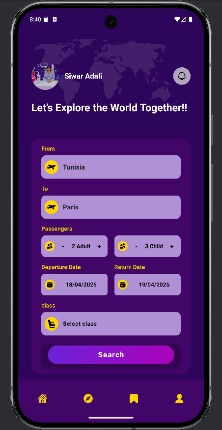
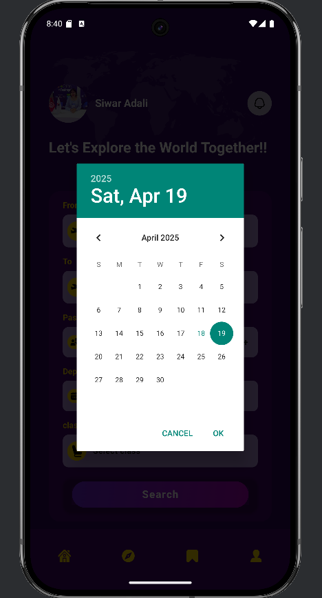
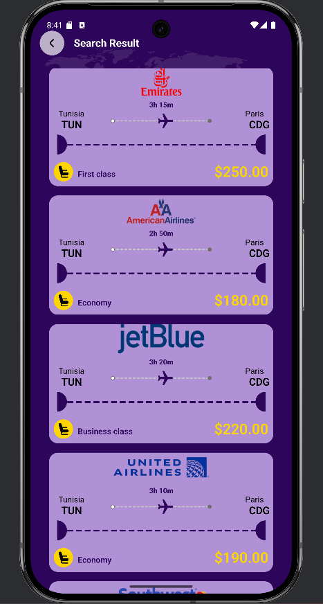
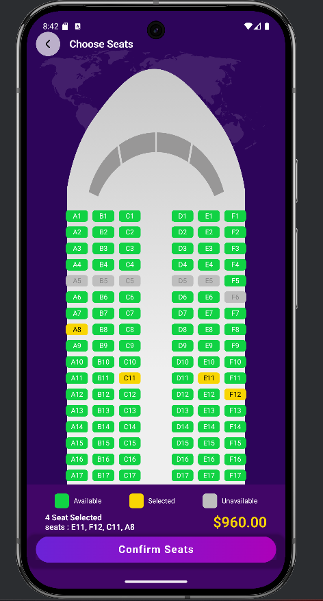
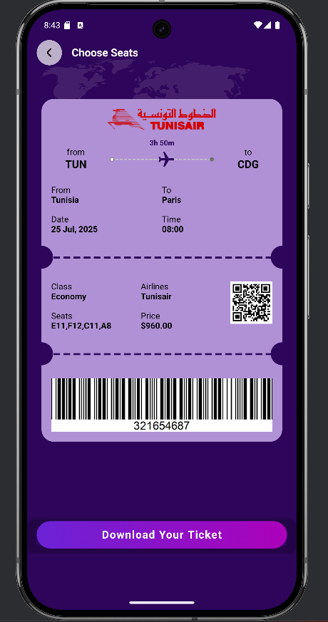

# ✈️ FlightBookingApp

An elegant Android Studio application for booking airplane tickets with a sleek and intuitive UI. Users can:

- 🌍 Select origin & destination
- 👥 Choose number of passengers
- 📅 Pick travel dates
- 🏷️ Filter by class (Economy, Business, First)
- ✈️ View flights with airline, price, and details
- 💺 Select seats from a live seat map
- 📃 Generate and download boarding passes

---

## 📱 UI Screenshots

| Home | Flight Search | Date Picker |
|------|----------------|--------------|
|  |  |  |

| Results | Seats | Ticket |
|---------|-------|--------|
|  |  |  |

---

## 🛠️ Tech Stack

- **Language:** Java  
- **IDE:** Android Studio  
- **UI:** XML Layouts, Material Design  
- **Backend:** *Firebase* (for realtime database and cloud messaging)

---

## 🚀 Getting Started

```bash
git clone https://github.com/adalisiwar/FlightBookingApp.git
cd FlightBookingApp
